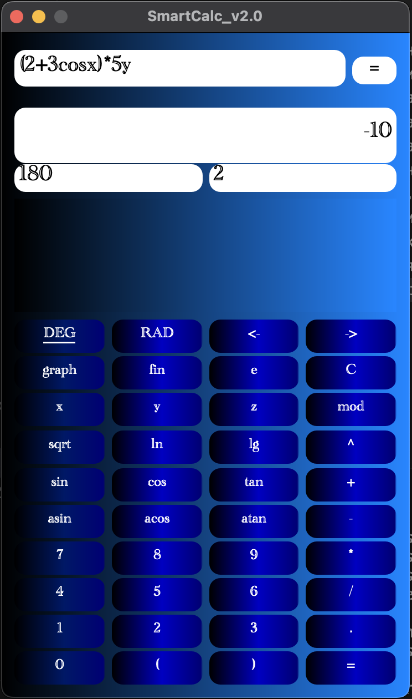
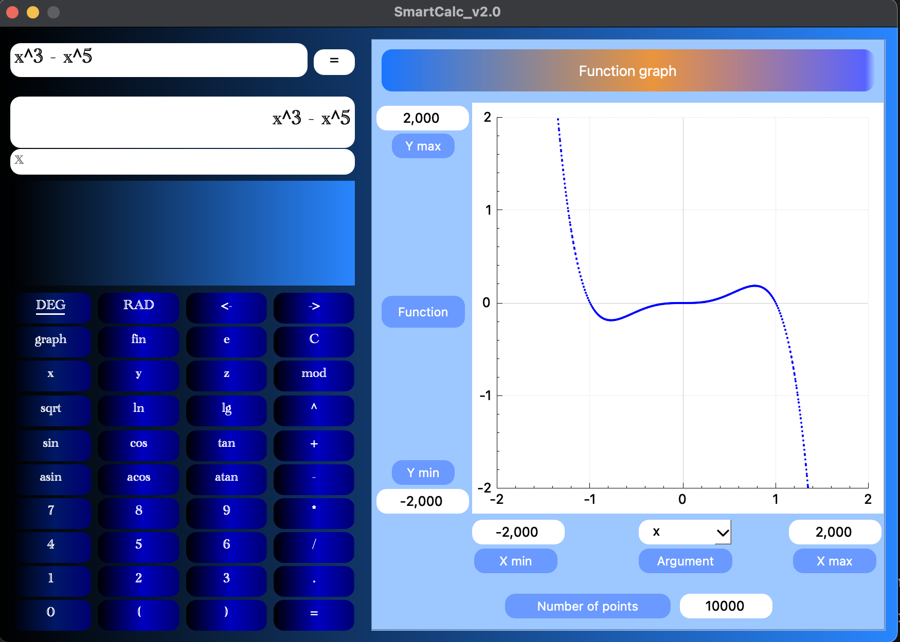
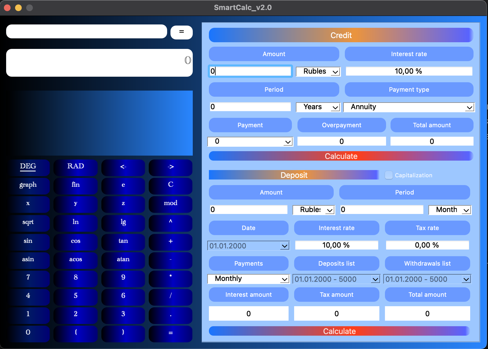
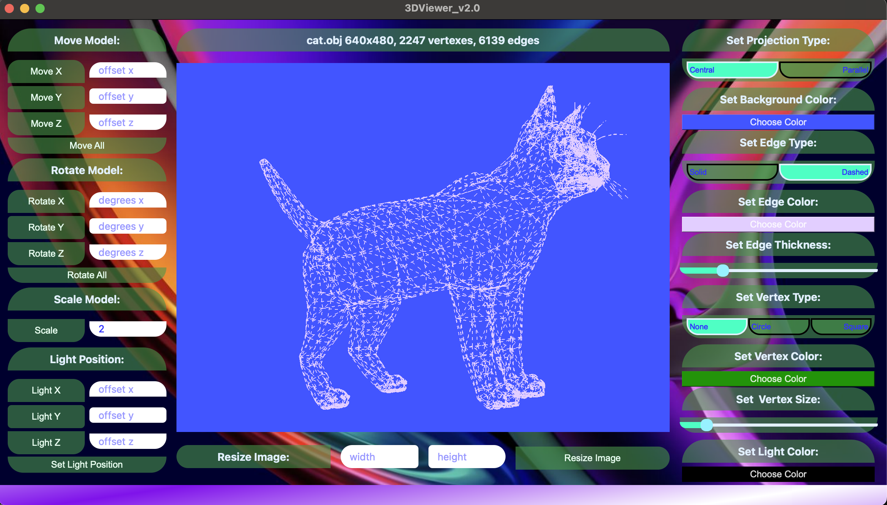
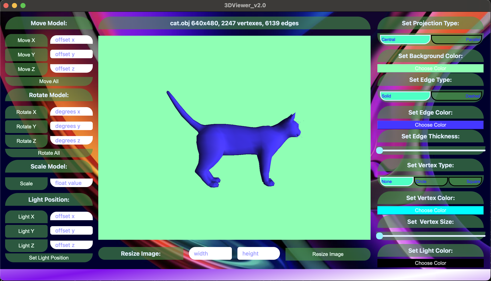
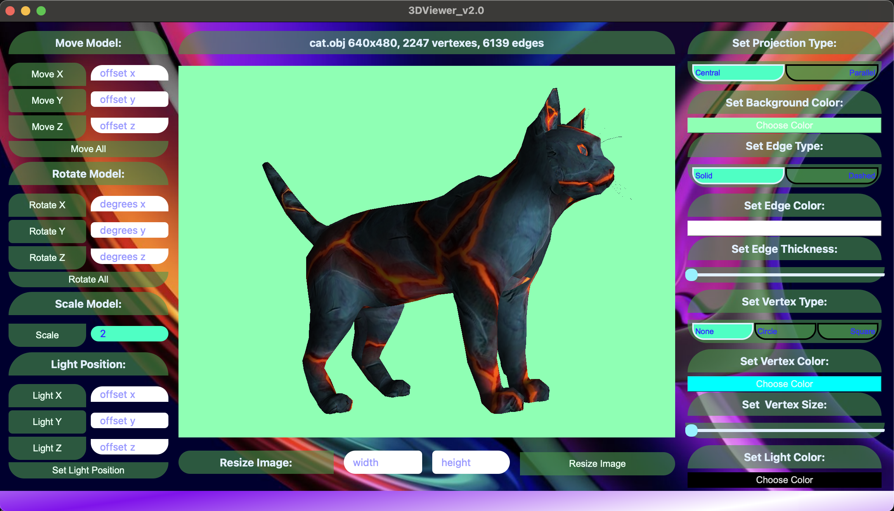
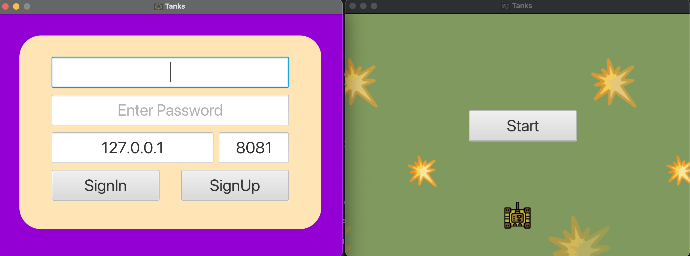
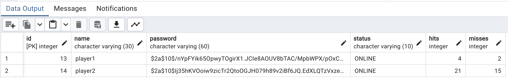
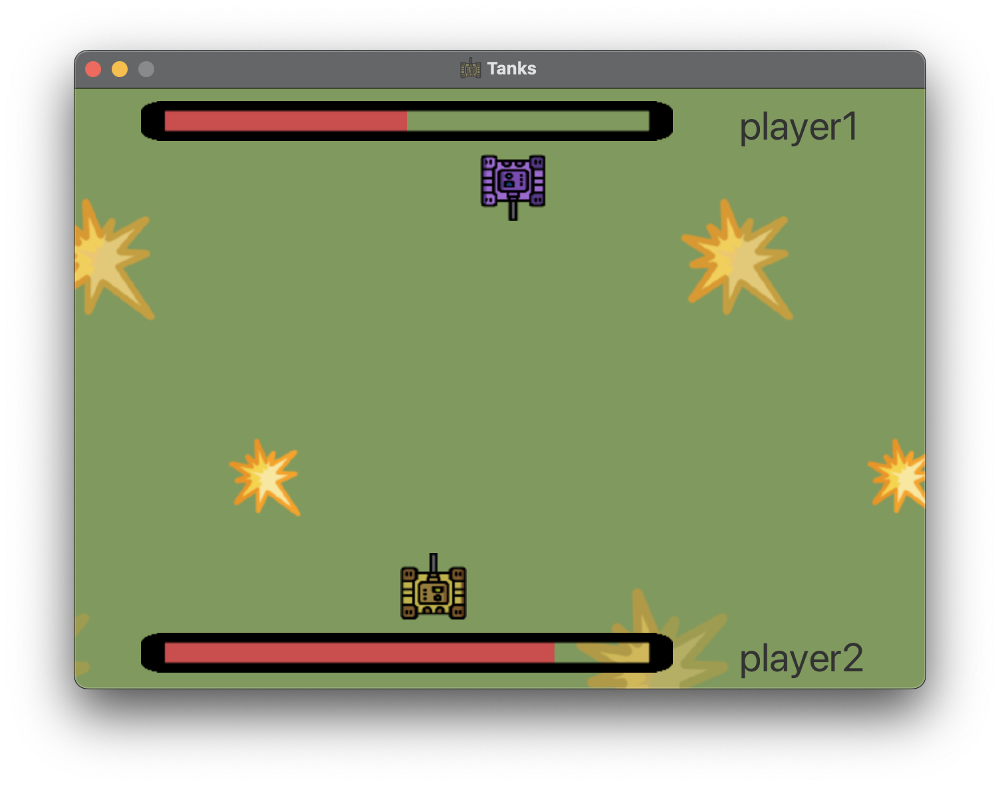
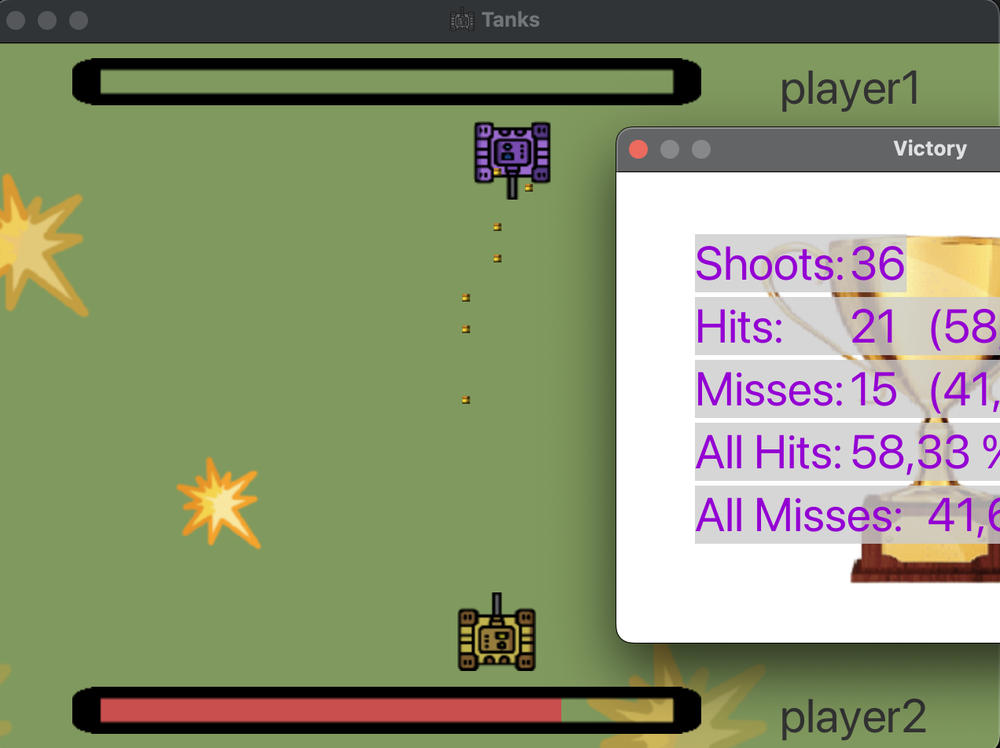

## Содержание

1. [Калькулятор](#калькулятор) \
    1.1. [Установка](#установка-калькулятора)
2. [3DViewer](#3dviewer) \
    2.1. [Установка](#установка-3dviewer)
3. [Tanks](#tanks) \
    3.1. [Установка](#установка-tanks)

# Калькулятор
[Содержание](#содержание)

В данном проекте на языке программирования С++ в парадигме объектно-ориентированного программирования реализована расширенная версия обычного калькулятора. Помимо базовых арифметических операций, как плюс-минус и умножить-поделить, калькулятор дополнен возможностью вычисления арифметических выражений с учетом приоритетов, а так же некоторыми математическими функциями (синус, косинус, логарифм и т.д.). Помимо вычисления выражений калькулятор так же поддерживает использование переменных x, y и z и способен строить график соответствующей функции. В качестве дополнительных улучшений есть кредитный и депозитный калькулятор.

В реализации калькулятора использован *алгоритм Дейкстры* для перевода выражений в *обратную польскую нотацию*.
Проект полностью соответстует заданию, расположенному в каталоге Smart_Culc (файл README_RUS.md).

## Установка Калькулятора
[Содержание](#содержание)

В каталоге проекта Smart_Culc следует перейти в каталог src и выполнить команду make (в системе должна быть установлена утилита Make, а также библиотека Qt).
 Запустить программу, если она расположена по данному пути (зависит от системы):
     &emsp;&emsp;*./SmartCalc_2.0.app/Contents/MacOS/SmartCalc_2.0*

# 3DViewer
[Содержание](#содержание)

Программа позволяет осуществлять визуализацию трехмерного объекта в каркасном виде и с закраской граней.

## Установка 3DViewer
[Содержание](#содержание)

В каталоге проекта 3D_Viewer следует перейти в каталог src и выполнить команду make (в системе должна быть установлена утилита Make, а также библиотека Qt).
 Запустить программу, если она расположена по данному пути (зависит от системы):
     &emsp;&emsp;*./3DViewer_2.0.app/Contents/MacOS/3DViewer_2.0*

# Tanks
[Содержание](#содержание)

Онлайн игра "Танки" - клиент-серверное приложение с использованием базы данных.

## Установка Tanks
[Содержание](#содержание)

В каталоге проекта GameTanks необходимо перейти в src/ex00 и следовать инструкциям по установке, описанным в README.md (в системе должна быть установлена PostgreSQL, Java (версия 21), система сборки Maven).
